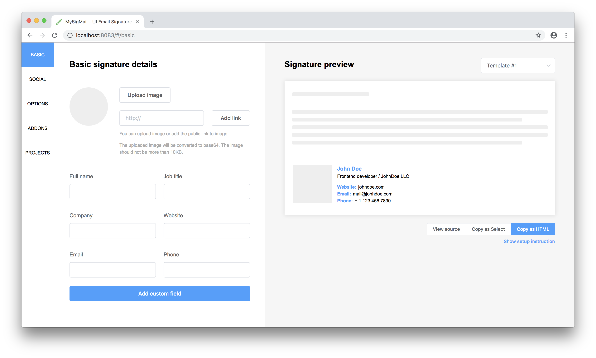

<p align="center">
  
  
</p>

Live demo - [https://mysigmail.com](https://mysigmail.com/)

## Purpose

Creating an email signature is not a trivial task, even for people who have knowledge of HTML and CSS. And what about ordinary users.

There are many solutions on the Internet, and most of them are paid. There are free, but all of them are closed source. I wanted to make a free application with a user-friendly interface and open source code.

So let's make creating email signatures easier!

## Features

- Upload image - upload to AWS S3 or set public link
- Custom fields - add custom fields
- Social icons - add social icons
- Options - customize signature
- Addons - additional options
- Templates - templates for signature
- Projects - save, download or import projects
- Signature preview - preview signature

## Roadmap

- Create more templates (PR Welcome)
- Create more addons (PR Welcome)

## Development

Set env variables

```bash
VUE_APP_AWS_S3_URL=
VUE_APP_AWS_S3_BASKET=
VUE_APP_AWS_S3_ID=
VUE_APP_AWS_S3_KEY=
```
Run

```bash
npm i
npm run serve
```

## Support project

If you liked the project, I am very grateful for the help to the project.

- [Become a backer on Patreon](https://www.patreon.com/antonreshetov)
- [Become a backer on Open Collective](https://opencollective.com/mysigmail)
